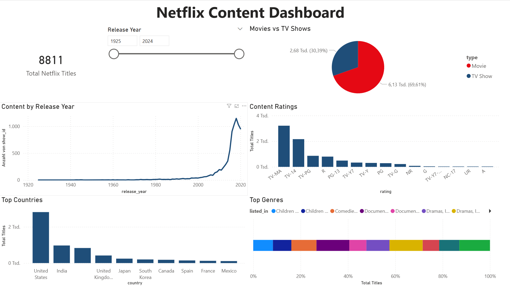
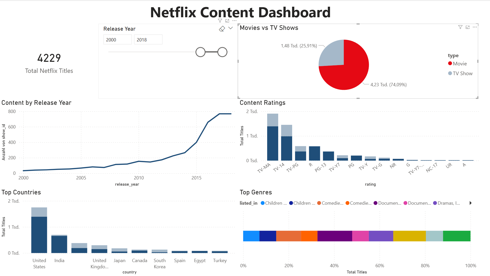
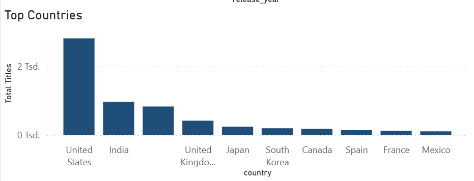

# Netflix Content Dashboard

This project explores the **Netflix Movies and TV Shows dataset** using **SQL and Power BI**.
The goal was to analyze Netflix's content library and visualize key insights in an interactive dashboard.

The project demonstrates a typical data analysis workflow:

* Data exploration using SQL
* Data cleaning and transformation
* Interactive dashboard creation with Power BI
* Project documentation and version control with GitHub

---

## Dashboard Overview



This dashboard provides an overview of Netflix's content catalog, including the total number of titles, distribution of movies and TV shows, content ratings, production countries, and trends over time.

---

## Key Insights

* The dataset contains **over 8800 Netflix titles**.
* **Movies represent the majority** of Netflix content, while TV Shows account for a smaller portion of the catalog.
* Netflix significantly increased its content production after **2015**, with a peak around **2018–2019**.
* The most common ratings are **TV-MA and TV-14**, indicating that a large portion of the catalog targets mature audiences.
* The **United States produces the most Netflix titles**, followed by countries such as **India and the United Kingdom**.

---

## Interactive Filtering

The dashboard includes a **Release Year slicer**, allowing users to explore how Netflix content evolved over time.

Example of filtering the dataset by recent years and movies:



---

## Example Visualization: Top Countries

This visualization shows how Netflix content is distributed across different countries.



---

## Tools Used

* **SQL (SQLite)** – Data exploration and analysis
* **Power BI** – Interactive dashboard creation
* **GitHub** – Project version control and documentation

---

## Project Structure

```
Netflix-Data-Dashboard
│
├── data
│   ├── netflix_titles.csv
│   └── netflix.db
│
├── sql
│   └── netflix_analysis.sql
│
├── powerbi
│   └── netflix_dashboard.pbix
│
├── screenshots
│   ├── dashboard_overview.png
│   ├── dashboard_filtered_recent_years.png
│   └── ratings_distribution.png
│
└── README.md
```

---

## Dataset

The dataset used in this project is the **Netflix Movies and TV Shows dataset from Kaggle**, which contains information about Netflix titles including type, release year, rating, country of production, and genres.

---

## Purpose of the Project

This project was created as a **portfolio project** to demonstrate practical skills in:

* SQL data exploration
* Data cleaning and transformation
* Data visualization with Power BI
* Building and presenting data projects on GitHub

